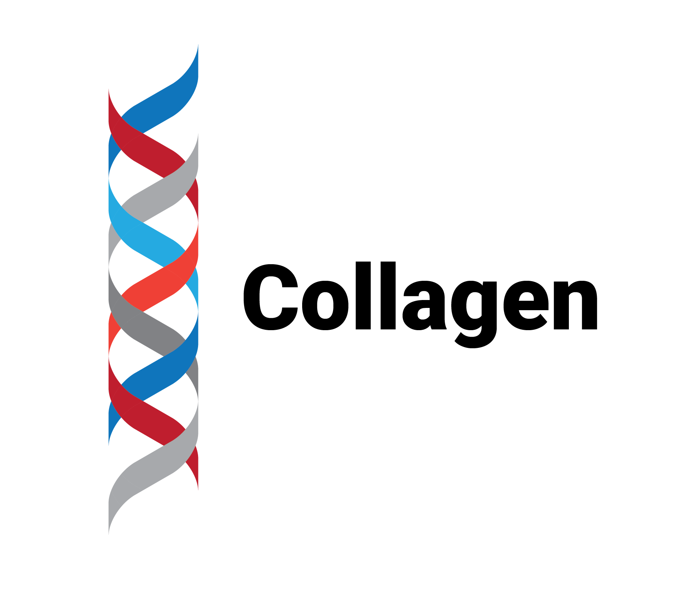

Collagen is a Python library for the manipulation and preparation of molecular data in machine learning pipelines. It serves as an interconnect between biological datasets, cheminformatics libraries and machine learning frameworks.

# Overview

TODO

# Features

TODO

# Documentation

TODO
