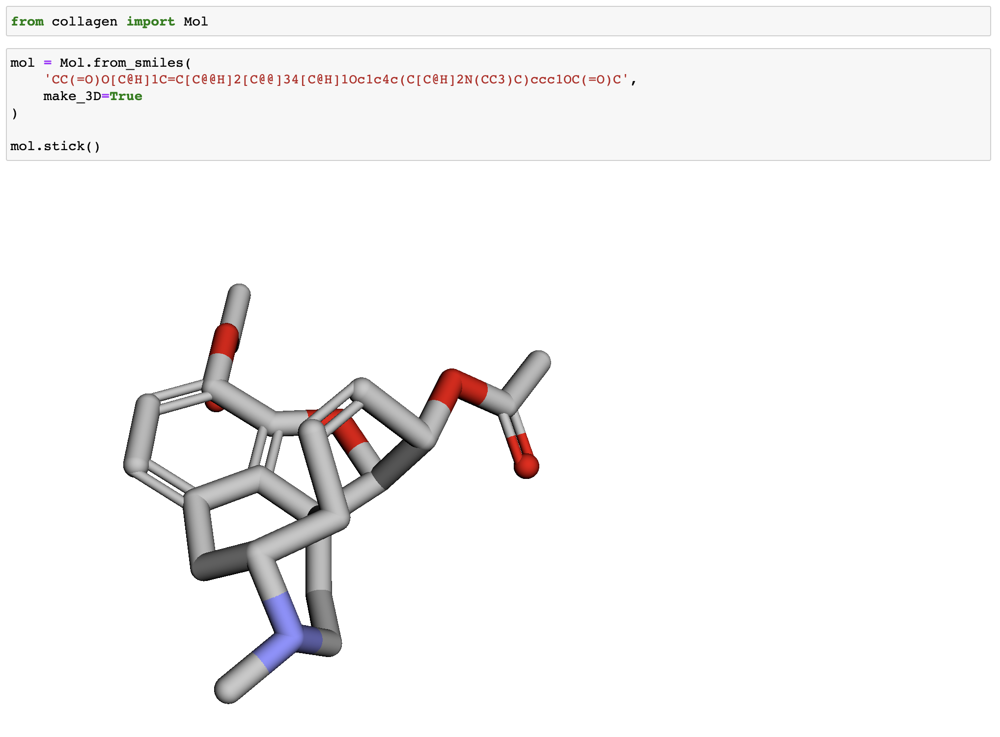
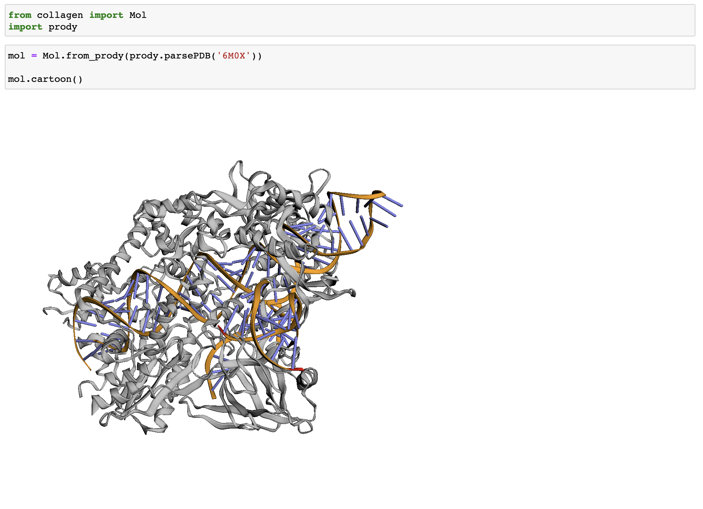
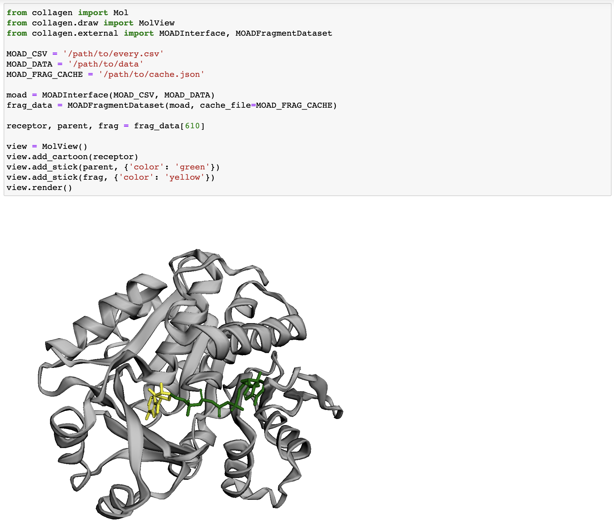

Jupyter
=======

Collagen provides several Jupyter visualization integrations:

Drawing Molecules
-----------------

Collagen integrates with `3DMol.js <https://3dmol.csb.pitt.edu/>`_ to display molecular information in-browser, for example in a Jupyter Notebook.

Shorthand
^^^^^^^^^

For quick-vizualization of :class:`~collagen.core.mol.Mol` objects, you can use the provided methods:

.. autosummary::
   ~collagen.core.mol.Mol.cartoon
   ~collagen.core.mol.Mol.sphere
   ~collagen.core.mol.Mol.stick

Examples:

Loading a Mol from a smiles string and rendering in stick format:

Loading a protein with Prody and rendering it in cartoon format:

MolView
^^^^^^^

For more advanced visualizations, such as rendering multiple molecules or rendering metadata, you can use the :class:`collagen.draw.MolView` class. This class acts as a thin wrapper over a ``py3dmol.view`` object.

Examples:

Rendering a sample from :class:`~collagen.external.moad.fragment.MOADFragmentDataset`:

