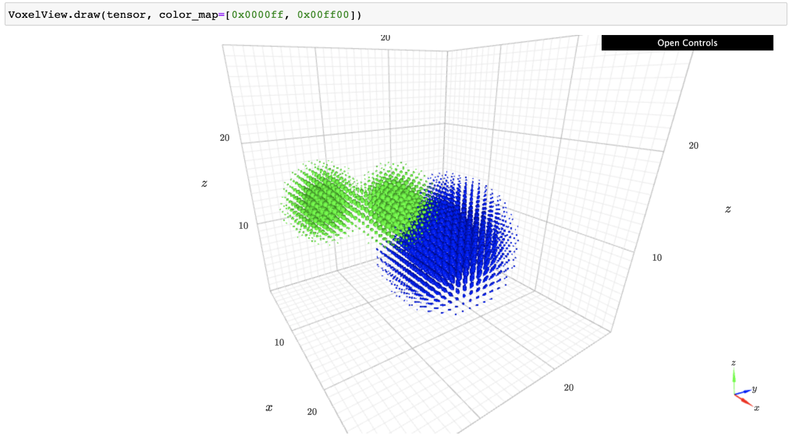

Voxelization
============

Collagen provides CPU/GPU voxelization utilities for converting molecular structures to 3D density tensors. A density tensor is a ``NxWxWxW`` matrix with ``N`` channels and ``W`` grid points. In machine learning applications, different atoms are typically assigned to different *density channels* based on properties like atomic number or higher level features such as aromaticity. In Collagen, this process of channel-assignment is called *atom featurization* and is implemented by the :class:`~collagen.AtomFeaturizer` class.

Voxel Parameters
----------------

In Collagen, voxelation methods accept a single :class:`~collagen.VoxelParams` container object which specifies how structures are transformed into density tensors. An example of the parameters used in DeepFrag are shown below:

.. code-block:: python

    vp = VoxelParams(
        resolution=0.75,
        width=24,
        atom_scale=1.75,
        atom_shape=VoxelParams.AtomShapeType.EXP,
        acc_type=VoxelParams.AccType.SUM,
        atom_featurizer=AtomicNumFeaturizer([1,6,7,8,16])
    )

.. list-table::
   :widths: 50 50
   :header-rows: 1

   * - Parameter
     - Meaning
   * - resolution (:class:`~float`)
     - Distance in Angstroms between neighboring gridpoints. A smaller number will "zoom in" on the structure more.
   * - width (:class:`~int`)
     - Number of grid points in each dimension. I.e. a value of ``24`` will produce a tensor of size ``Nx24x24x24``.
   * - atom_scale (:class:`~float`)
     - Optional scale applied to each atomic radius.
   * - atom_shape (:class:`~collagen.VoxelParams.AtomShapeType`)
     - An enum that describes the atom shape function.
   * - acc_type (:class:`~collagen.VoxelParams.AccType`)
     - An enum that describes how to handle overlapping atomic densities.
   * - atom_featurizer (:class:`~collagen.AtomFeaturizer`)
     - An :class:`~collagen.AtomFeaturizer` class that assigns atoms to channels and computes atomic radii for each atom.

Collagen also provides a set of default voxelization parameters in :class:`~collagen.VoxelParamsDefault` as used in recent machine learning papers:

.. list-table::
   :widths: 50 50
   :header-rows: 1

   * - ``collagen.VoxelParamsDefault.*``
     - Source
   * - :class:`~collagen.VoxelParamsDefault.DeepFrag`
     - `"DeepFrag: a deep convolutional neural network for fragment-based lead optimization" <https://doi.org/10.1039/D1SC00163A>`_

Voxelize a Single Mol
---------------------

The :class:`~collagen.Mol` class provides a :py:meth:`~collagen.Mol.voxelize` method to generate a tensor for a single molecule:

.. automethod:: collagen.Mol.voxelize

Voxelize a Batch of Mols
------------------------

While training machine learning models, it is useful to generate a batch of voxelized molecules at once. The :class:`~collagen.Mol` class also provides a :py:meth:`~collagen.Mol.voxelize_into` method which can perform in-place voxelization with an existing PyTorch tensor.

Note that if you invoke :py:meth:`~collagen.Mol.voxelize_into` with ``cpu=False``, your tensor must be on the GPU (i.e. initialized with ``device='cuda'``). You can use :py:meth:`collagen.VoxelParams.tensor_size` to compute the target tensor size for a multi-batch tensor.

.. automethod:: collagen.Mol.voxelize_into

Delayed Voxelation (advanced)
-----------------------------

In specific cases, you may want to perform atom featurization in a multiprocess CPU pool and GPU-accelerated voxelization later, on a single GPU. For this workflow, you can use :py:meth:`~collagen.Mol.voxelize_delayed` to perform atom featurization and cache necessary arguments for voxeliation in a :class:`~collagen.DelayedMolVoxel` object. The returned :class:`~collagen.DelayedMolVoxel` class provides a single :py:meth:`~collagen.DelayedMolVoxel.voxelize_into` method. For example:

.. code-block:: python

    m = Mol.from_smiles(
        'CC(=O)O[C@H]1C=C[C@@H]2[C@@]34[C@H]1Oc1c4c(C[C@H]2N(CC3)C)ccc1OC(=O)C',
        make_3D=True
    )
    
    # On CPU
    delayed = m.voxelize_delayed(
        VoxelParamsDefault.DeepFrag,
        center=m.center,
        rot=np.array([1,0,0,0])
    )

    # On GPU
    tensor = torch.zeros(VoxelParamsDefault.DeepFrag.tensor_size(1), device='cuda')
    delayed.voxelize_into(tensor, batch_idx=0, cpu=False)

Custom Molecule Voxelization
----------------------------

Voxelization is supported for real molecular data (:class:`~collagen.BackedMol`) as well as abstract, pseudo-molecular data (:class:`~collagen.AbstractMol`). You can create custom :class:`~collagen.AbstractMol` to perform voxelization on arbitrary data (e.g. pharmacaphores). For example:

.. code-block:: python

  from collagen import AbstractMol, AbstractAtom, AtomFeaturizer, VoxelParams

  mol = AbstractMol()

  mol.add_atom(
      AbstractAtom(coord=[0,0,0], metadata={
          'type': 'hydrophobic',
          'size': 8
      })
  )

  mol.add_atom(
      AbstractAtom(coord=[4,4,4], metadata={
          'type': 'aromatic',
          'size': 5
      })
  )

  mol.add_atom(
      AbstractAtom(coord=[10,10,4], metadata={
          'type': 'aromatic',
          'size': 5
      })
  )
    
  class CustomFeaturizer(AtomFeaturizer):
      def __init__(self, variants):
          self.variants = variants
        
      def featurize(self, atom):
          # Return (layer_bitmask, atom_radius)
          typ = atom.metadata['type']
          if typ in self.variants:
              return (1 << self.variants.index(typ), atom.metadata['size'])
          else:
              return (0,0)
    
      def size(self):
          # Return the number of channels.
          return len(self.variants)

    
  vp = VoxelParams(
      width=24,
      resolution=1,
      atom_featurizer=CustomFeaturizer([
          'hydrophobic',
          'aromatic'
      ])
  )

  tensor = mol.voxelize(vp, cpu=True)

